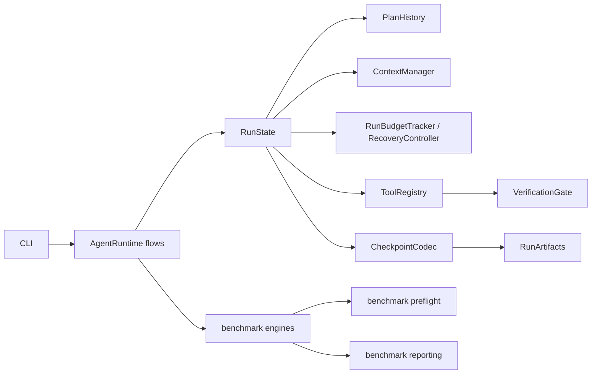

# #33 状态、生命周期与兼容

RunState 唯一持有消息、失败/恢复记录、pending/in-flight 调用、审批决定、观察 tracker 和完成结果；PlanHistory、ContextManager、ToolRegistry、验证列表为同一对象的组合引用，保存点不复制另一套状态。CheckpointCodec 在这一阶段读写 schema 1/2，输出仍为 2；#34 负责磁盘格式变更。

| 来源 | 允许目标 |
| --- | --- |
| 初始 | RUNNING |
| RUNNING | WAITING_FOR_APPROVAL、SUCCEEDED、UNVERIFIED、FAILED、STOPPED、BUDGET_EXCEEDED |
| WAITING_FOR_APPROVAL / STOPPED / BUDGET_EXCEEDED | RUNNING（显式 resume / approval） |
| SUCCEEDED / UNVERIFIED / FAILED | 不可恢复 |

相同状态保存幂等，不重复产生 status_changed；不新增产品状态。模型请求、实际工具执行、失败 Recovery、Checkpoint 保存分别由独立内部流程处理。执行前先持久化 in-flight，结果保存后才清除调用；恢复未知执行不重放，剩余 pending 继续。未知结果会清空探索窗口，避免把可能改变的仓库沿用为旧观察段。

VerificationGate 只选择验证证据并判断 completion_allowed；命令执行仍在 ToolRegistry/ExecutionEnvironment。check_id、supersedes、required commands、Plan Step 覆盖、前后代码指纹保持。无验证仍为 UNVERIFIED。

benchmark 拆分在独立提交中进行，runner 公共入口、两引擎结果、runtime-patch 与 harness patch 及旧证据读取维持兼容。已有恢复、审批、预算与验证失效回归是验收依据，不用文件行数作指标。
